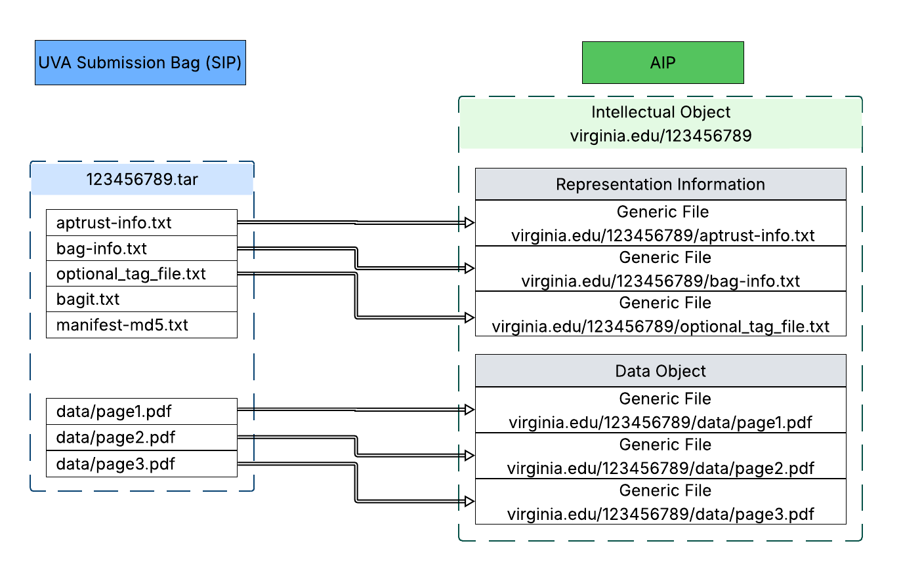
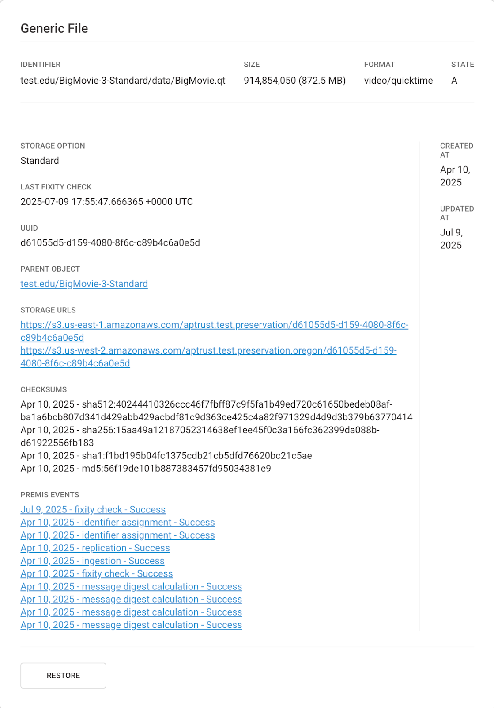

# 4.2.4 Convention that generates persistent, unique identifiers for AIPs

## Requirement Text

The repository shall have and use a convention that generates persistent, unique identifiers for all AIPs.

In particular the following aspects must be checked:

[4.2.4.1 The repository shall uniquely identify each AIP within the repository.](04.02.04.01-uniquely-identify-each-aip.md)

[4.2.4.1.1 The repository shall have unique identifiers.](04.02.04.01.01-have-unique-identifiers.md)

[4.2.4.1.2 The repository shall assign and maintain persistent identifiers of the AIP and its components so as to be unique within the context of the repository.](04.02.04.01.02-assign-and-maintain-persistent-identifiers-of-the-aip-and-its.md)

[4.2.4.1.3 Documentation shall describe any processes used for changes to such identifiers.](04.02.04.01.03-describe-any-processes-for-changes-to-identifiers.md)

[4.2.4.1.4 The repository shall be able to provide a complete list of all such identifiers and do spot checks for duplications.](04.02.04.01.04-provide-a-list-of-all-identifiers-and-check-for-duplications.md)

[4.2.4.1.5 System of identifiers is adequate now and in the future.](04.02.04.01.05-system-of-identifiers-is-adequate-now-and-in-the-future.md)

## Supporting Text

This is necessary in order to ensure that each AIP can be unambiguously found in the future. This is also necessary to ensure that each AIP can be distinguished from all other AIPs in the repository.

## Examples for Meeting the Requirement

Documentation describing naming convention and physical evidence of its application (e.g., logs).

## Evidence Provided

*Figure 1. A diagram mapping the partial transformation of a member-deposited SIP into a preservation AIP, showing how semantic identifiers are constructed for objects and files.*

The APTrust naming conventions are documented in the APTrust User Guide, when describing PREMIS events for [objects](https://aptrust.github.io/userguide/registry/events/) and [files](https://aptrust.github.io/userguide/registry/events/#file-level-events).

The Intellectual Object semantic persistent unique identifier consists of the domain name of the owner institution, followed by a forward slash, followed by the name of the object/bag assigned by the depositor. For example, “virginia.edu/123456789”. In addition to the semantic identifier, objects are also assigned an opaque database record numeric identifier for disambiguation (internal identifier).

Files have two identifiers. One is a semantic identifier in the form of “domain name / bag name / path of file within SIP”. For example, “virginia.edu/123456789/data/page1.pdf” (see the diagram above). Second is an UUID  assigned during ingest that is used internally. The UUID serves as the object name in preservation storage and helps associate files and events. (Original file names are reapplied upon restoration.)

*Figure 2. A screenshot of a generic file record stored in APTrust. It displays both the semantic identifier and UUID, demonstrating that the UUID is used to locate the file in preservation storage.*
