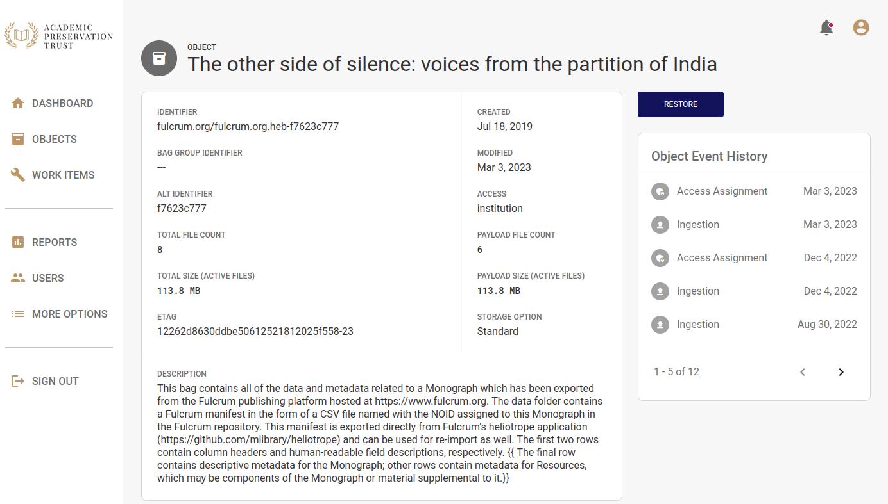

# 4.2.6.2 Execute documented processes for acquiring PDI

## Requirement Text

The repository shall execute its documented processes for acquiring PDI.

## Evidence Provided

APTrust executes its documented PDI acquisition processes during:

- Ingest (validation of BagIt structure, checksum verification, identifier assignment, PREMIS event generation).
- Update workflows (addition of files or metadata, recorded as PREMIS events).
- Restoration workflows (verification of fixity and inclusion of PREMIS event history in reconstructed DIPs).

Access controls are enforced at the institutional level. Each APTrust member manages its own users, and members cannot view or access files deposited by other institutions. These controls are implemented through system configuration and identity management and complement the PDI framework by ensuring that custody and control remain clearly defined.

Through this combination of depositor-supplied metadata, repository-generated preservation metadata, identifier management, documented workflows, and system-enforced controls, APTrust ensures that PDI is systematically acquired, permanently associated with the Content Data Object, and maintained to support authenticity, integrity verification, contextual understanding, and auditability.

See Figure 1 for an example of how PDI is displayed in Registry.

*Figure 1. An example in Registry showing the Object Details.*

See also [APTtrust Intellectual Objects](https://docs.aptrust.org/user-guide/registry/objects/) and [APTrust Bagging Requirements](https://docs.aptrust.org/user-guide/depositing/).
