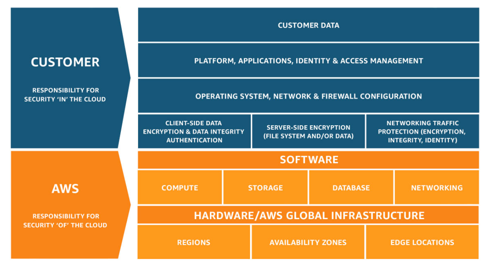

# 5.1.1.5 Defined processes for storage media and/or hardware change (e.g., refreshing, migration)

The repository shall have defined processes for storage media and/or hardware change (e.g., refreshing, migration).

## Supporting Text

This is necessary in order to ensure that data is not lost when either the media fails or the supporting hardware can no longer be used to access the data.

## Examples for Meeting the Requirement

Documentation of migration processes; policies related to hardware support, maintenance, and replacement; documentation of hardware manufacturer’s expected support life cycles; policies related to migration of records to alternate hardware systems.

## Discussion

The repository should have estimates of the access speed and the quantity of infonnation for each type of storage media. Then with estimates of the reliable lifetime of the storage media and information of system loading, etc., the repository can estimate the time required for storage media migration, or refreshing or copying between media without reformatting the bit stream. The repository can then set triggers for initiating the action at an appropriate time so the actions will be completed before data is lost. Copying large quantities of data can take a long time and can affect other system performance metrics. Repositories should also consider the obsolescence of any and all hardware components within the repository system as potential trigger events for migration. Increasingly, long-tenn, appropriate support for system hardware components is difficult to obtain, exposing repositories to risks and liabilities should they choose to continue to operate the hardware beyond the manufacturer or third-party support warranties. Repositories will likely need to perform media migration off of some types of media onto better supported media based on the estimated lifetime of hardware support rather than on the longer life expected from the media. It is important that the process include a check that the copying has happened correctly.

## Evidence Provided

APTrust has made two significant architectural choices to address storage media and hardware change.

The first is to provide services on the AWS Public Cloud. Doing so removes the need to manage any and all physical hardware and physical storage media responsibilities from APTrust. As part of the Shared model – shown below – AWS now manages all the data centers, physical hardware, storage media, and other physical infrastructure that host APTrust’s systems for preservation throughout the lifecycle, with the exception of Wasabi.

Both AWS and Wasabi are certified to meet the ISO 27001 framework, which includes asset management.

[AWS ISO 27001](https://d1.awsstatic.com/certifications/iso_27001_global_certification.pdf)

“Wasabi is deployed in top tier data centers certified for SOC 2, ISO 27001 and PCI-DSS. Copies of SOC 2 or ISO 27001 reports for data centers can be obtained by requesting them here.”

[Wasabi 27001 ISO](https://wasabi.com/compliance/)

The second choice was to move from the management of the virtual/logical implementations of such media and hardware. This was accomplished by going to a platform based implementation (PaaS) or other services totally managed by AWS, for the application services. Instead of servers, APTrust now operates as micro-services bundled in containers, run on container hosting platforms such as AWS’ ECS. AWS is now responsible for the complete lifecycle of the supporting hardware, virtual or physical. APTrust is responsible for the containers themselves, and the application. Non-container services are offered as PaaS services, or even SaaS services, such as monitoring servics, where APTrust need only integrate and enable the functionality, but has no responsibility for any infrastructure at all.

## AWS Shared Responsibility Matrix

